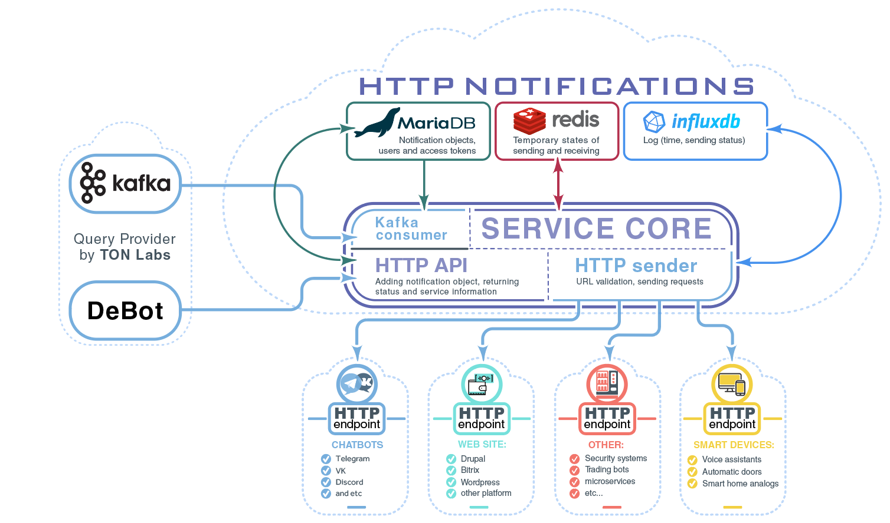

# HTTP Notification Service

Features:
- Guaranteed delivery of http notifications
  - No losses even in case of a server’s emergency shutdown
  - Repeated delivery in case of unavailability of the recipient or his error
  - Optimized delivery system with configurable attempt intervals and their duration
- Cross-platform
- Extended support of HTTP recipient notification (url)
  - basic authorization
  - support of POST, GET, PUT, JSON-RPC 2.0 methods of HTTP
  - Correct work with HTTPS recipients
  - support of custom port
- All settings and optimizations in one file ([config.yml](docs/ConfigYML.md))
- Verification of domain or page ownership to protect the recipient
  - via robots.txt
  - via meta tags within the html page or the main page of the website
  - configuring exceptions for debugging
- Correct error processing
  - Generates error codes with a short message.
  - the service does not break down when submitting incorrect data
- Logging of sending events to InfluxDB (for import to Grafana, etc.)
- Built-in freeze protection that stops the application in case of inactivity  
- In the future, the use of more databases (PostgreSQL, H2, SQLite, Oracle, SQL Server) due to the utilization of the ORM framework

Presentation and demonstration of work on YouTube: [youtu.be/XkrFFRWj_UA](https://youtu.be/XkrFFRWj_UA)

## Documentation
- [Installation](docs/INSTALL.md)
- [Usage](docs/USAGE.md)
  - [More about the app parameters](docs/ConfigYML.md)

## Testing
To test the fact of receiving http notifications, you can use the following publicly accessible services:
- https://pipedream.com/ (recommended, has a shutdown support)
- https://requestinspector.com/ (the simplest one)
- https://mocklab.io/ (beautiful)

__Important__: When testing other URLs (the above URLs are added to debug exceptions), you must  [verify ownership of the domain or page](docs/USAGE.md#protecting-the-recipient-page). 

### Testing with decryption support
A [special test server](https://github.com/chain-action/httpserver4encoded-notifications) with [protocol](https://tonlabs.notion.site/Notification-provider-onboarding-3dd961bce8954d0da80208b9a908c773) decryption support was developed to receive notifications